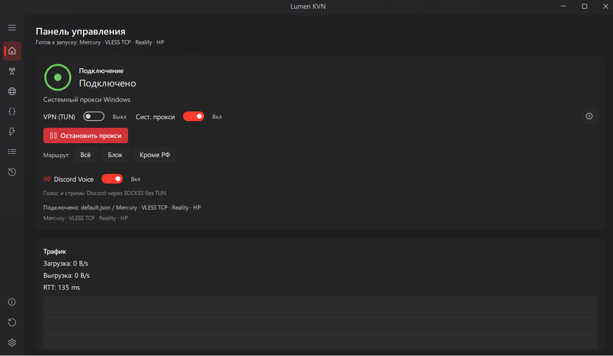
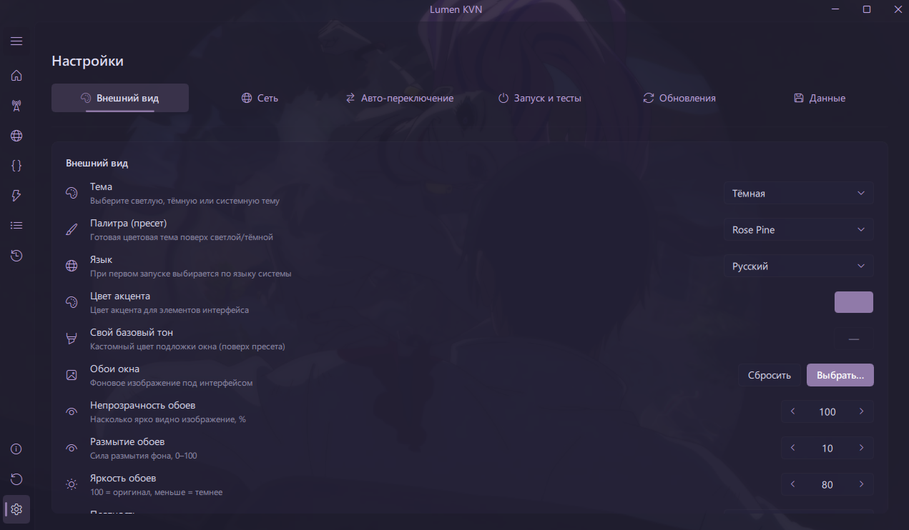

# Lumen KVN

<p align="center">
  
</p>

<p align="center">
  <a href="https://github.com/krambovic/Lumen-KVN/releases"></a>
  <a href="https://github.com/krambovic/Lumen-KVN/releases"></a>
  
</p>

<p align="center">
  <b>Язык:</b> <a href="README.md">English</a> | <b>Русский</b>
</p>

---

Lumen KVN - самостоятельный Windows-клиент для VPN/TUN, системного прокси, маршрутизации, управления серверами и обхода DPI (DPI bypass) через zapret. Проект предлагает графический интерфейс на базе QML с эффектами Mica/Acrylic и аппаратным ускорением рендеринга.

> [!IMPORTANT]
> Для работы TUN/VPN режимов и запуска средств обхода DPI (zapret) требуются права администратора.

---

## Скриншоты

<details>
<summary>Панель управления и темы оформления</summary>
<br>


<br><br>

<br><br>

<br><br>

<br><br>


</details>

---

## Возможности программы

| Раздел | Используемые компоненты | Описание |
| :--- | :--- | :--- |
| **Обход DPI** | zapret / WinDivert | Обход замедлений и блокировок YouTube, Discord и других сервисов на уровне пакетов. |
| **TUN / VPN** | sing-box-extended | Полноценный TUN-режим с поддержкой AmneziaWG (AWG 2.0), WireGuard и XHTTP. |
| **Прокси** | xray-core | Системный прокси (VLESS, Trojan, Shadowsocks, VMess). |
| **Маршрутизация** | GUI-пресеты | Удобная настройка маршрутов через интерфейс: пресеты, пользовательские домены, IP-правила и поведение отдельных сервисов. |
| **Discord Voice** | droute / SOCKS5 | Направляет голосовые каналы и стримы Discord через прокси без включения полного TUN-режима. |
| **Диагностика** | встроенные тесты | Проверка ping и реальной скорости скачивания серверов. |
| **Интерфейс** | PyQt6 / QML | Динамические акцентные цвета, темы оформления и поддержка фоновых обоев. |

---

## Поддерживаемые протоколы

Lumen KVN поддерживает импорт и запуск таких типов серверов:

- **Xray / системный прокси:** VLESS, VMess, Trojan, Shadowsocks, SOCKS, HTTP.
- **sing-box / TUN:** Hysteria, Hysteria2, TUIC, Mieru, MASQUE, WireGuard, AmneziaWG (AWG), WARP.
- **Кастомные конфиги:** raw Xray и sing-box JSON-конфиги, включая импорт полных sing-box конфигов.

## Поддержка подписок

- Обычные URL подписок и зашифрованные ссылки Happ: `happ://crypt`, `happ://crypt2`, `happ://crypt3`, `happ://crypt4` и `happ://crypt5`.
- Подписки с привязкой по HWID: Lumen может отправлять настоящий HWID устройства Windows (включено по умолчанию) или указанный пользователем HWID.
- Метаданные и поддерживаемые функции подписок Happ Premium отображаются прямо в списке серверов и свойствах подписки.

> [!NOTE]
> Для полной поддержки расшифровки `happ://crypt5` должен быть установлен [Node.js](https://nodejs.org/), доступный через `PATH`. Более ранние форматы `happ://crypt` Lumen расшифровывает самостоятельно.

## Установка и запуск

Перейдите на страницу **[Releases](https://github.com/krambovic/Lumen-KVN/releases)** и скачайте актуальную версию:

* **Установщик (`LumenKVN-Setup-windows-x64.exe`):** Рекомендуется для большинства пользователей.
* **Портативная версия (`LumenKVN-portable-windows-x64.zip`):** Работает без установки.

> [!CAUTION]
> **Windows Defender или другой антивирус может ошибочно обнаружить угрозу в Lumen KVN или его встроенных компонентах.** Lumen содержит сетевые инструменты Xray, sing-box и zapret, умеет создавать TUN-интерфейс, а также изменяет системный прокси и маршрутизацию. Эти возможности вместе с упаковкой неподписанного приложения через PyInstaller могут срабатывать на эвристические правила антивирусов, даже если вредоносного кода нет. Скачивайте Lumen только со страницы официальных [релизов GitHub](https://github.com/krambovic/Lumen-KVN/releases). Не отключайте антивирус полностью: если файл заблокирован, проверьте название обнаружения и отправьте его разработчику антивируса как ложное срабатывание либо добавьте локальное исключение только после проверки источника файла.

---

## Быстрый старт

1. Запустите Lumen KVN от имени администратора.
2. Импортируйте ссылку сервера или поддерживаемый `.conf` файл.
3. Выберите режим подключения: системный прокси, VPN/TUN или обход DPI через zapret.
4. Выберите пресет маршрутизации и подключитесь.

WARP, WireGuard, AmneziaWG, Hysteria, Hysteria2, TUIC, Mieru и MASQUE конфиги работают через TUN на `sing-box-extended`; VLESS, VMess, Trojan, Shadowsocks, SOCKS и HTTP ссылки можно использовать через режим системного прокси.

---

## Сборка проекта (для разработчиков)

<details>
<summary><b>Показать инструкции по сборке</b></summary>

1. Установите зависимости проекта:
   ```powershell
   pip install -r requirements.txt
   ```
2. Поместите исполняемые файлы ядер (`xray.exe`, `sing-box.exe`, `wintun.dll`, файлы базы GeoIP) в каталог `core/`.
3. Запустите скрипт компиляции и сборки:
   ```powershell
   python build_qml.py
   ```
Сборка создает установщик и портативный архив в директории `dist/`.
</details>

---

## Star History

<a href="https://www.star-history.com/?repos=krambovic%2FLumen-KVN&type=date&legend=top-left">
 <picture>
   <source media="(prefers-color-scheme: dark)" srcset="https://api.star-history.com/chart?repos=krambovic/Lumen-KVN&type=date&theme=dark&legend=top-left&sealed_token=fW_XUyA3Qay011mKD7tuewBXpt8nzW6MbbuhvhOy-y-fr9jxvjrRZ_K88QIDpCds5soFksO_3iAvFQ9bkLGkB9My96Lkis7F7wxOS5LzxAb8FXS2yXAbrLbB-oBrdliut-myHmPUuPT8QPARlDbYrE7_dL2-sMUq6luZ_bOH15ALx_8XEKtC6iMCsI9f" />
   <source media="(prefers-color-scheme: light)" srcset="https://api.star-history.com/chart?repos=krambovic/Lumen-KVN&type=date&legend=top-left&sealed_token=fW_XUyA3Qay011mKD7tuewBXpt8nzW6MbbuhvhOy-y-fr9jxvjrRZ_K88QIDpCds5soFksO_3iAvFQ9bkLGkB9My96Lkis7F7wxOS5LzxAb8FXS2yXAbrLbB-oBrdliut-myHmPUuPT8QPARlDbYrE7_dL2-sMUq6luZ_bOH15ALx_8XEKtC6iMCsI9f" />
   
 </picture>
</a>

---

## Участники проекта

[](https://github.com/krambovic/Lumen-KVN/graphs/contributors)

---

## Лицензия

Проект Lumen KVN поставляется под лицензией GPL-3.0. Сторонние бинарные файлы и библиотеки сохраняют свои оригинальные лицензии. Подробнее: [LICENSE](LICENSE) и [NOTICE.md](NOTICE.md).
