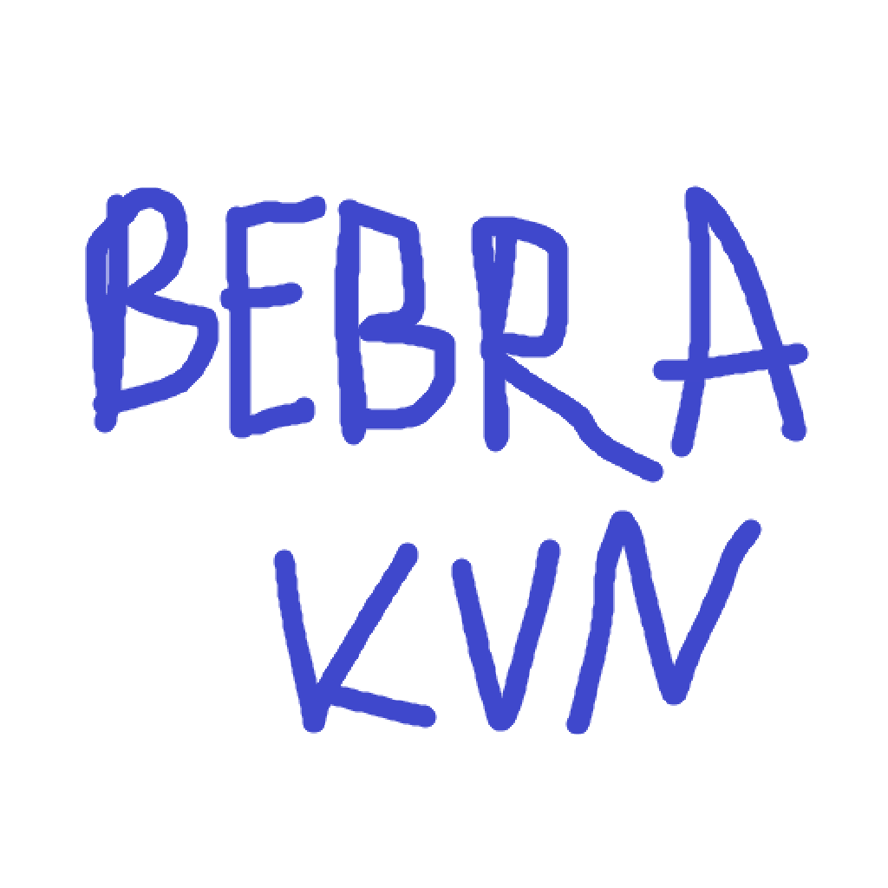

# Bebra VPN

  

Bebra VPN (`bebra-kvn`) — форк проекта [youtubediscord/zapret-kvn](https://github.com/youtubediscord/zapret-kvn).

Проект сохраняет copyright и атрибуцию upstream-репозитория. Текущая upstream-лицензия `youtubediscord/zapret-kvn` — GPL-3.0, все изменения этого форка публикуются в [krambovic/bebra-kvn](https://github.com/krambovic/bebra-kvn).

## Что Это

Bebra VPN объединяет в одном Windows-клиенте xray-core, sing-box и встроенный zapret/DPI bypass. Приложение рассчитано на быстрый запуск без ручного редактирования JSON-конфигов.

Основные возможности:

- импорт VLESS, Trojan, Shadowsocks и VMess ключей;
- системный proxy-режим;
- TUN/VPN-режим;
- встроенный zapret;
- проверка ping и скорости серверов;
- маршрутизация по доменам, IP, сервисам и приложениям;
- компактный и полный режим интерфейса;
- автообновление приложения и ядра xray.

## Установка

Скачайте последнюю версию на странице [Releases](https://github.com/krambovic/bebra-kvn/releases).

- `BebraVPN-Setup-windows-x64.exe` — обычный установщик Windows. Приложение появится в списке установленных программ, в меню Пуск и, при выборе опции, на рабочем столе.
- `BebraVPN-portable-windows-x64.zip` — portable-версия без установки.

Для TUN/VPN и zapret требуются права администратора.

## Upstream И Fork

Этот репозиторий является форком:

- upstream: [youtubediscord/zapret-kvn](https://github.com/youtubediscord/zapret-kvn)
- fork: [krambovic/bebra-kvn](https://github.com/krambovic/bebra-kvn)

Если вы распространяете измененные копии, сохраняйте GPL-3.0 license notice и сведения об upstream/fork.

## Сторонние Компоненты

В сборку входят сторонние компоненты со своими лицензиями:

- [Xray-core](https://github.com/XTLS/Xray-core)
- [sing-box](https://github.com/SagerNet/sing-box)
- [tun2socks](https://github.com/xjasonlyu/tun2socks)
- zapret/WinDivert bundle в каталоге `zapret/`

Подробности смотрите в [NOTICE.md](NOTICE.md) и файлах лицензий внутри соответствующих компонентов.

## Лицензия

GPL-3.0. См. [LICENSE](LICENSE).
