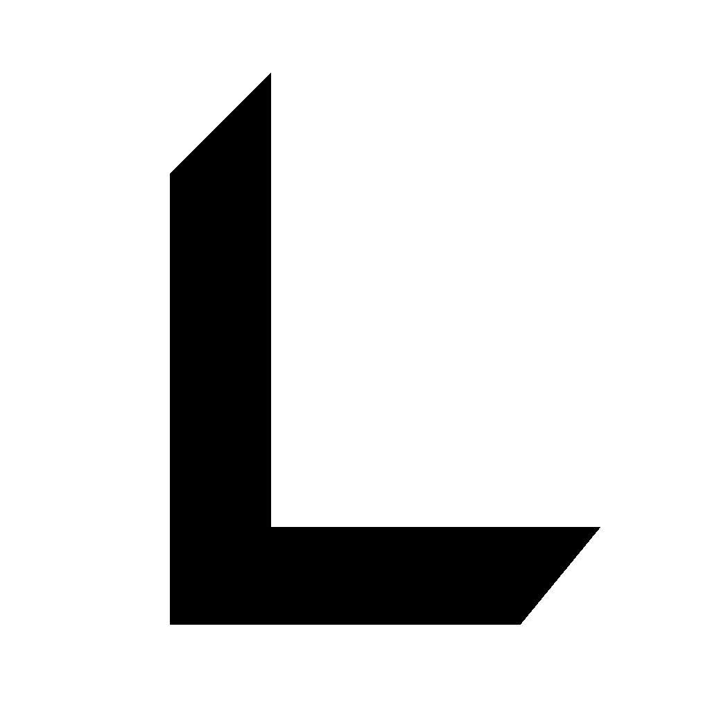
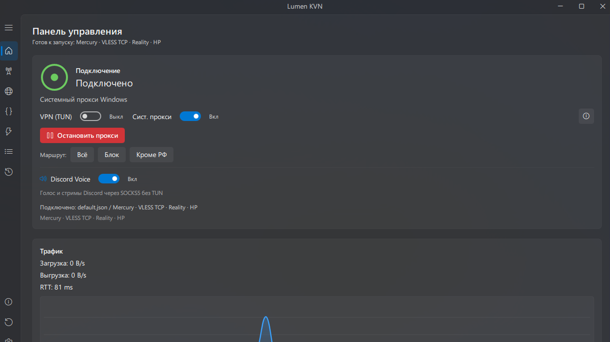
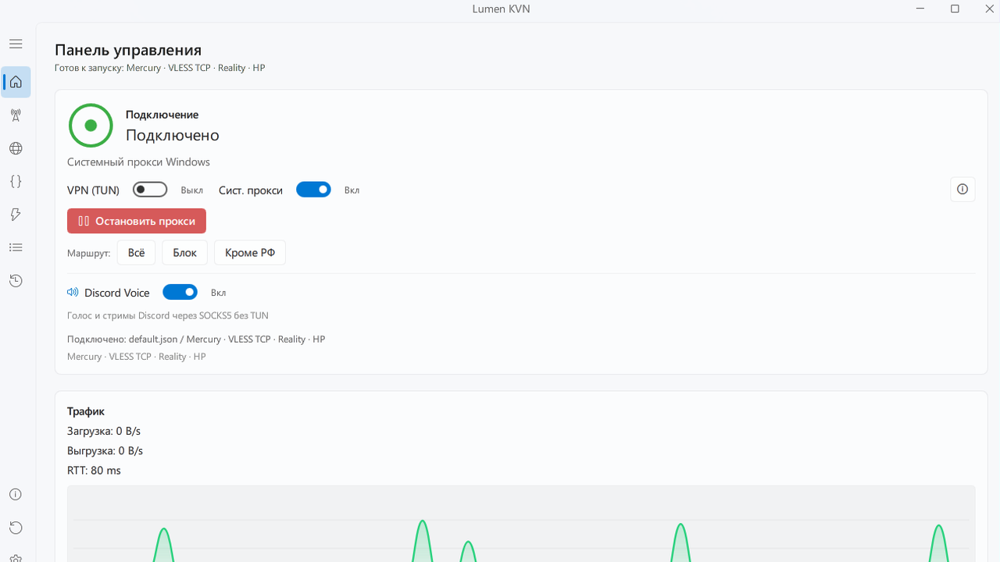
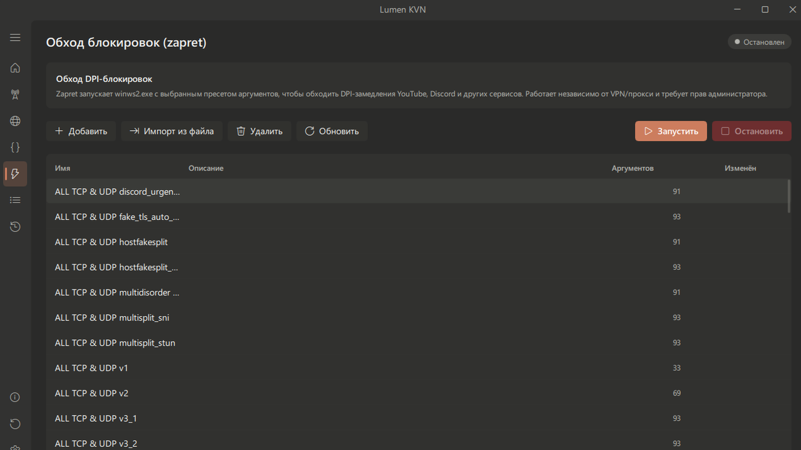

# Lumen KVN

<p align="center">
  
</p>

<p align="center">
  <a href="https://github.com/krambovic/Lumen-KVN/releases">
    
  </a>
  <a href="https://github.com/krambovic/Lumen-KVN/releases">
    
  </a>
  
</p>

<p align="center">
  <b>Language:</b> English | <a href="README-RU.md">Русский</a>
</p>

---

Lumen KVN is a standalone Windows client for VPN/TUN, system proxy, routing, server management, and DPI bypass through zapret. It features a modern GPU-rendered QML interface with Mica/Acrylic effects.

> [!IMPORTANT]
> TUN/VPN modes and DPI bypass features (zapret) require Administrator privileges.

---

## Screenshots

<table>
  <tr>
    <td width="33%">
      
      <sub><b>Dashboard</b> · dark theme</sub>
    </td>
    <td width="33%">
      
      <sub><b>Dashboard</b> · light theme</sub>
    </td>
    <td width="33%">
      
      <sub><b>zapret</b> · DPI bypass presets</sub>
    </td>
  </tr>
</table>

---

## Features

| Category | Components Used | Description |
| :--- | :--- | :--- |
| **DPI Bypass** | zapret / WinDivert | DPI circumvention for YouTube, Discord, and other services on packet level. |
| **TUN / VPN** | sing-box-extended | Fully-featured TUN mode with support for AmneziaWG (AWG 2.0), WireGuard, and Necko/XHTTP. |
| **Proxy** | xray-core | System proxy mode (VLESS, Trojan, Shadowsocks, VMess). |
| **Diagnostics** | built-in tests | Latency (ping) and real download speed testing for servers. |
| **Interface** | PyQt6 / QML | Dynamic accent colors, custom theme presets (including Codex), and wallpaper support. |

---

## Installation

Go to the **[Releases](https://github.com/krambovic/Lumen-KVN/releases)** page and download the appropriate package:

* **Installer (`LumenKVN-Setup-windows-x64.exe`):** Recommended for most users.
* **Portable version (`LumenKVN-portable-windows-x64.zip`):** Standalone archive that runs without installation.

---

## Quick Start

1. Run Lumen KVN as Administrator.
2. Import a server link or a supported `.conf` file.
3. Choose the connection mode: system proxy, VPN/TUN, or zapret DPI bypass.
4. Select a routing preset and connect.

WARP, WireGuard, and AmneziaWG configs are handled through TUN mode with `sing-box-extended`; regular VLESS, Trojan, Shadowsocks, and VMess links can be used through system proxy mode.

---

## Build Instructions (for Developers)

<details>
<summary><b>Show Build Instructions</b></summary>

1. Install project dependencies:
   ```powershell
   pip install -r requirements.txt
   ```
2. Put core executables (`xray.exe`, `sing-box.exe`, `wintun.dll`, and GeoIP database files) in the `core/` directory.
3. Run the build script:
   ```powershell
   python build_qml.py
   ```
The build output will be located in the `dist/` directory.
</details>

---

## Star History

[](https://star-history.com/#krambovic/Lumen-KVN&Date)

---

## Contributors

[](https://github.com/krambovic/Lumen-KVN/graphs/contributors)

---

## License

Lumen KVN is licensed under GPL-3.0. Integrated third-party components preserve their original licenses. See [LICENSE](LICENSE) and [NOTICE.md](NOTICE.md) for details.
