<p align="center">
  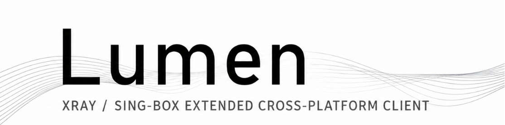
</p>

<p align="center">
  <a href="https://github.com/krambovic/Lumen/releases"></a>
  <a href="https://github.com/krambovic/Lumen/releases"></a>
  
  
</p>

<p align="center">
  <b>English</b> · <a href="README-RU.md">Русский</a>
</p>

---

**Lumen** is a VPN and anti-censorship client for **Windows** and **Android**. One app for the whole chain: import a server or a subscription, route only what you want through it, and get past DPI blocking — with a native interface on both platforms instead of a config file.

Windows runs **xray-core** and **sing-box-extended** side by side and adds packet-level DPI bypass. Android is a native Jetpack Compose client built on **sing-box-extended** and Android's `VpnService`.

> [!IMPORTANT]
> On Windows, TUN/VPN mode and the DPI bypass (zapret) need Administrator rights.

---

## Features

| | What it does | Windows | Android |
| :--- | :--- | :---: | :---: |
| **TUN / VPN** | Full-tunnel mode over sing-box-extended, including AmneziaWG (AWG 2.0) and WireGuard | ✅ | ✅ |
| **System proxy** | Routes the whole system through xray-core without a tunnel | ✅ | — |
| **DPI bypass** | zapret / WinDivert — unblocks YouTube, Discord and others at packet level | ✅ | — |
| **Split tunneling** | Choose exactly which apps go through the VPN | ✅ | ✅ |
| **Routing editor** | Presets plus your own domains, IP rules and per-service behaviour | ✅ | ✅ |
| **Discord voice** | Sends Discord voice and streams through the proxy without full TUN | ✅ | — |
| **AUTO server pools** | `urltest` groups pick the fastest server and re-check it on a timer | ✅ | ✅ |
| **Diagnostics** | Latency and real download-speed tests; TCP, ICMP, HTTP GET and real-proxy ping | ✅ | ✅ |
| **Quick controls** | Tray menu on Windows; home-screen widgets and a Quick Settings tile on Android | ✅ | ✅ |
| **Themes** | Built-in theme presets, plus AMOLED black and Material You on Android | ✅ | ✅ |

---

## Supported protocols

| Family | Protocols |
| :--- | :--- |
| **Core** | VLESS · VMess · Trojan · Shadowsocks · SOCKS · HTTP |
| **Modern** | Hysteria · Hysteria2 · TUIC · MASQUE · Mieru · AnyTLS · NaïveProxy |
| **WireGuard** | WireGuard · AmneziaWG (AWG 1.5 and 2.0) · Cloudflare WARP |
| **Other** | OpenVPN, including obfs2/obfs3 bridges |
| **Transports** | TCP · WebSocket · gRPC · HTTP/2 · HTTPUpgrade · XHTTP · mKCP · REALITY · uTLS |

Raw **Xray** and **sing-box** JSON configs import as-is, including whole multi-profile documents.

---

## Subscriptions

- Plain subscription URLs, plus encrypted Happ links: `happ://crypt` through `happ://crypt5`.
- HWID-locked subscriptions — send a per-install identifier or your own custom HWID.
- Happ Premium metadata, traffic usage and expiry shown right in the server list.
- Automatic refresh on a schedule, using Lumen's own User-Agent first and falling back to other client profiles only for panels that gate on the client name.
- Websites can hand a subscription straight to the app:
  ```
  lumen://add?url=<percent-encoded-subscription-url>&name=<optional-name>
  ```

---

## Screenshots

<details>
<summary><b>Windows screenshots</b></summary>
<br>

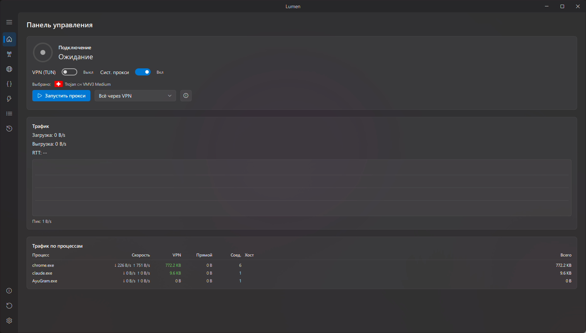
<br><br>
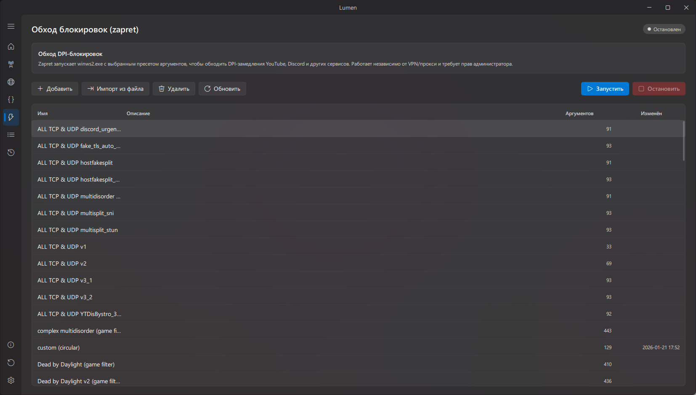
<br><br>
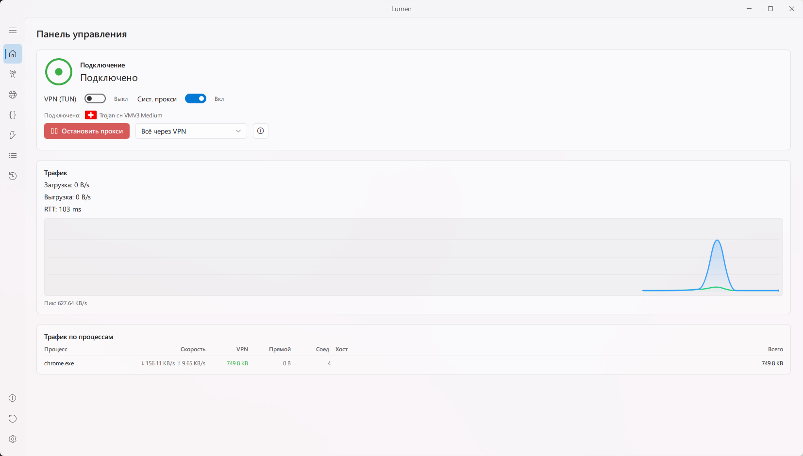
<br><br>
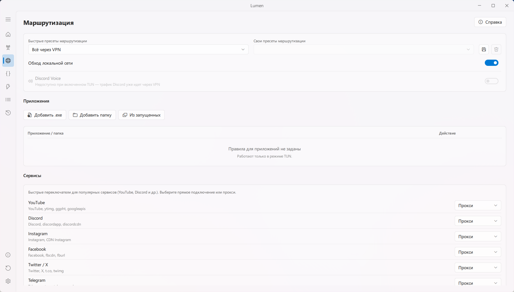
<br><br>
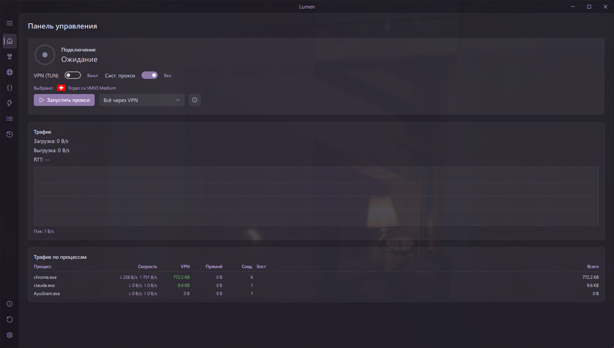
<br><br>
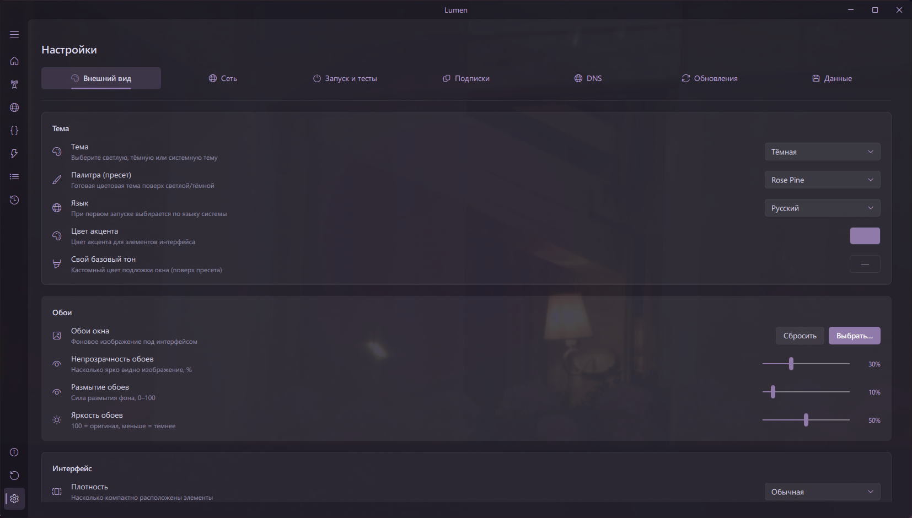

</details>

<details>
<summary><b>Android screenshots</b></summary>
<br>

<p align="center">
  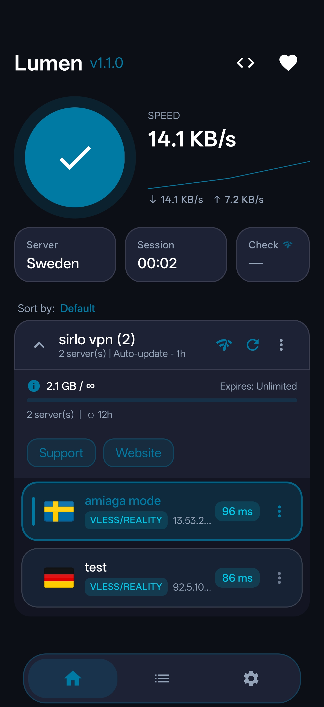
  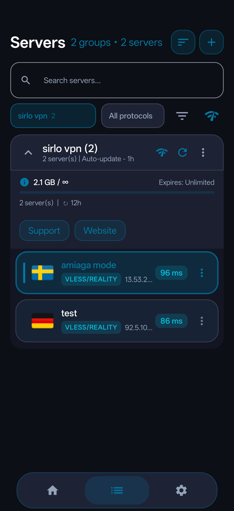
</p>

<p align="center">
  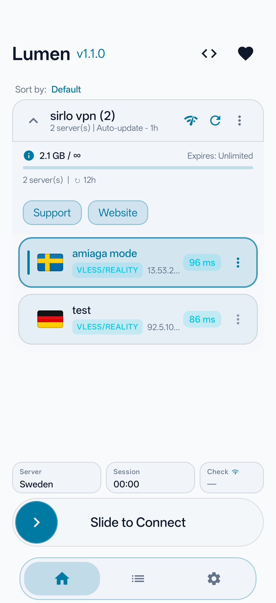
  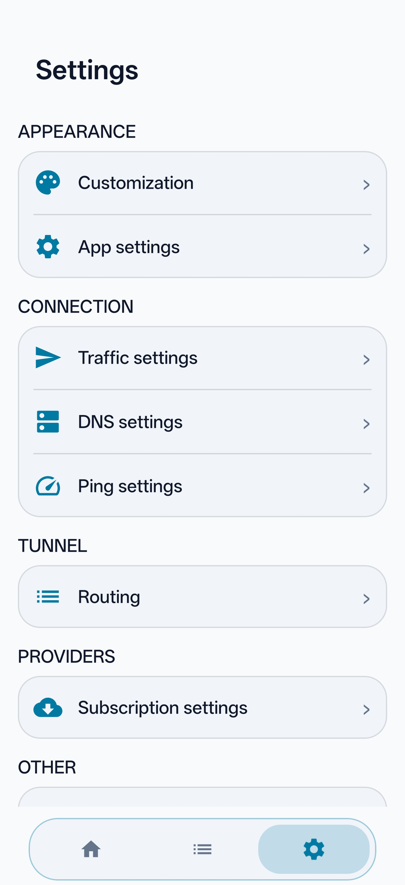
</p>

<p align="center">
  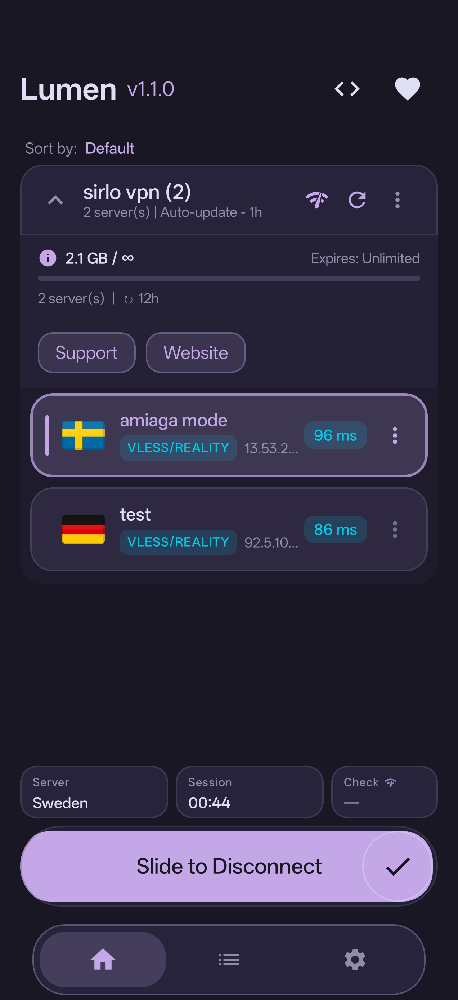
  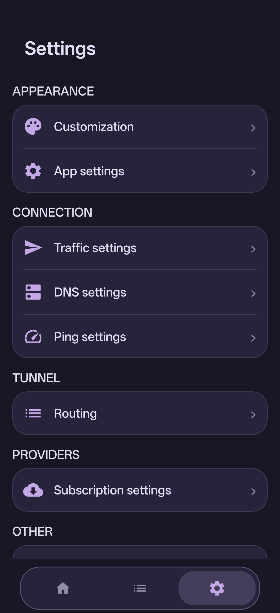
</p>

</details>

---

## Install

Grab the latest build from the **[Releases](https://github.com/krambovic/Lumen/releases)** page.

| Platform | File | Notes |
| :--- | :--- | :--- |
| Windows | `Lumen-Setup-windows-x64.exe` | Recommended installer |
| Windows | `Lumen-portable-windows-x64.zip` | Runs without installing |
| Android | `Lumen-<version>-universal.apk` | All supported ABIs in one larger file |
| Android | `Lumen-<version>-arm64-v8a.apk` | Almost every modern phone |
| Android | `Lumen-<version>-armeabi-v7a.apk` | 32-bit ARM devices |

---

## Building

<details>
<summary><b>Windows</b> — Python 3, PyQt6</summary>

```powershell
cd windows
pip install -r requirements.txt
python build_qml.py   # installer + portable archive in windows/dist/
python run_qml.py     # run from source
pytest                # test suite
```
</details>

<details>
<summary><b>Android</b> — JDK 17, Gradle</summary>

```powershell
cd android
./gradlew assembleRelease    # APKs in app/build/outputs/apk/release/
./gradlew testDebugUnitTest  # unit tests
```

Release signing reads `keystore.properties` next to `settings.gradle.kts`; without it the build stays unsigned.
</details>

---

## Repository layout

```
windows/   Python + PyQt6/QML desktop client, xray-core, sing-box-extended, zapret
  assets/           Windows assets and README screenshots
  run_qml.py       application launcher
  xray_fluent/     application services and desktop UI
    application/   service orchestration
    engines/       xray-core and sing-box backends
    qml_app/       Python/QML bridge and views
  zapret/          DPI bypass components
  tests/           Windows client tests
android/   Jetpack Compose client
  assets/           Android assets and README screenshots
  app/            navigation, view models, widgets
  ui/             Compose screens, themes, design tokens
  core/config     link parsing, config builders, AmneziaWG normalisation
  core/engine     core process management
  core/vpn        VpnService, split tunneling, QS tile
  core/database   Room storage
```

---

## License

Lumen is licensed under **GPL-3.0**. Bundled third-party components keep their own licenses — see [LICENSE](LICENSE) and [NOTICE.md](NOTICE.md).
