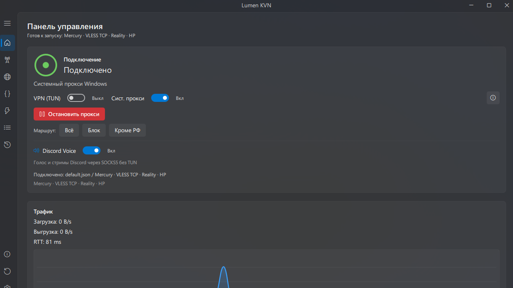
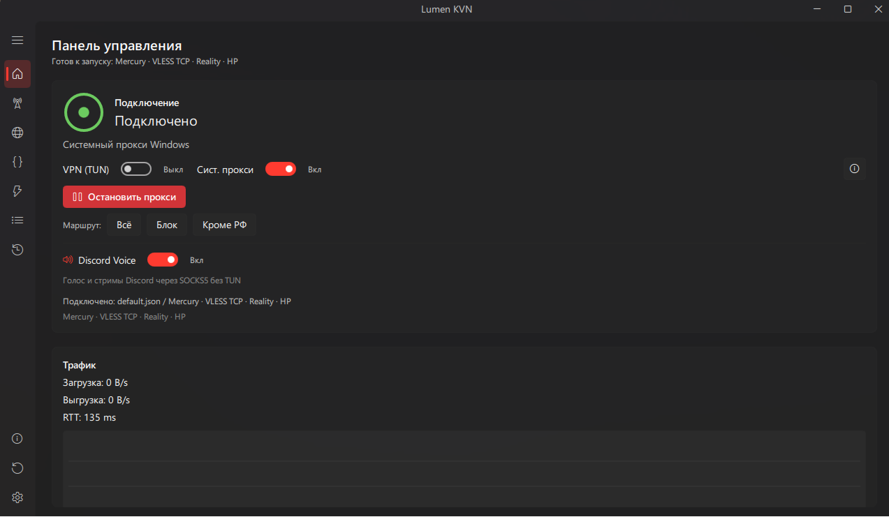
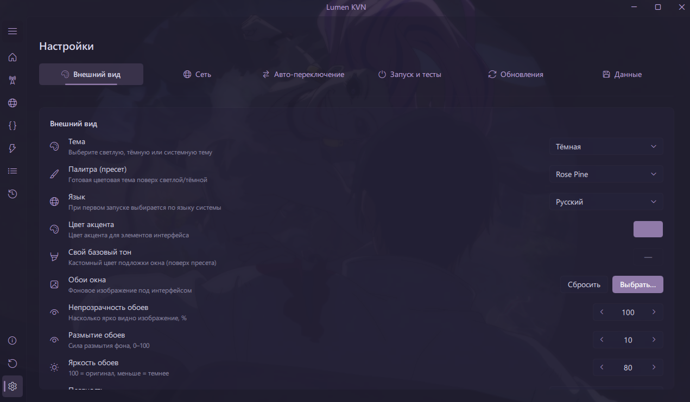
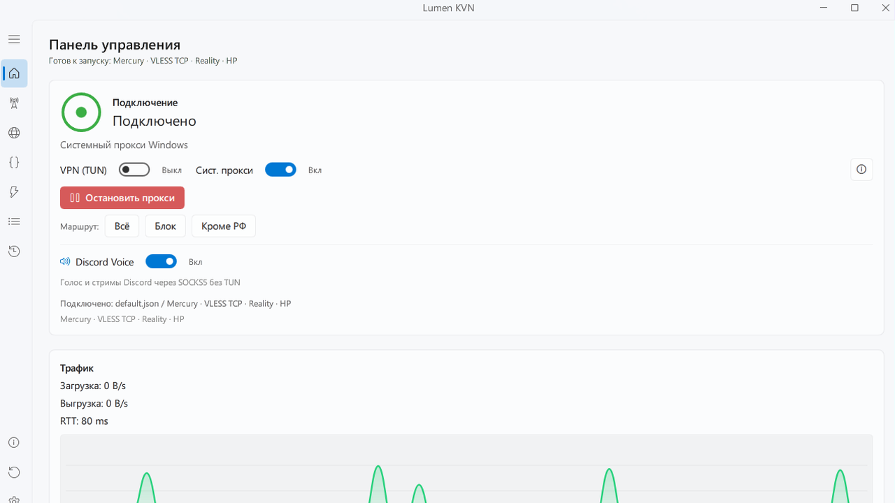
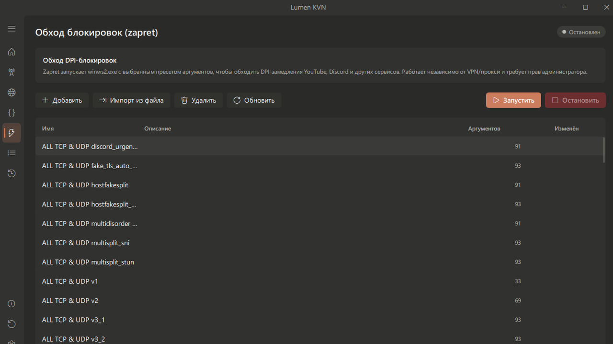

# Lumen

<p align="center">
  
</p>

<p align="center">
  <a href="https://github.com/krambovic/Lumen/releases"></a>
  <a href="https://github.com/krambovic/Lumen/releases"></a>
  
</p>

<p align="center">
  <b>Language:</b> English | <a href="README-RU.md">Русский</a>
</p>

---

Lumen is a multi-platform client for VPN/TUN, system proxy, domain routing, server management, and DPI bypass. It supports both **Windows Desktop** (PyQt6 QML with Mica/Acrylic effects) and **Android** (Jetpack Compose with VpnService and extended sing-box Go core).

> [!IMPORTANT]
> On Windows, TUN/VPN modes and DPI bypass features (zapret) require Administrator privileges.

---

## Screenshots

<details>
<summary>Desktop Dashboard and theme previews</summary>
<br>


<br><br>

<br><br>

<br><br>

<br><br>


</details>

---

## Features

| Category | Components Used | Description |
| :--- | :--- | :--- |
| **DPI Bypass (Windows)** | zapret / WinDivert | DPI circumvention for YouTube, Discord, and other services on packet level. |
| **TUN / VPN** | sing-box-extended | Fully-featured TUN mode with support for AmneziaWG (AWG 2.0), WireGuard, and XHTTP. |
| **Proxy** | xray-core | System proxy mode (VLESS, Trojan, Shadowsocks, VMess). |
| **Routing** | GUI presets | Convenient routing editor with presets, custom domains, IP rules, and per-service behavior. |
| **Discord Voice** | droute / SOCKS5 | Routes Discord voice and streams through the proxy without enabling full TUN mode. |
| **Diagnostics** | built-in tests | Latency (ping) and real download speed testing for servers. |
| **Multi-platform** | Windows & Android | GPU-rendered QML interface on Windows & Jetpack Compose UI on Android. |

---

## Supported protocols

Lumen supports importing and running these server types:

- **Xray / system proxy:** VLESS, VMess, Trojan, Shadowsocks, SOCKS, HTTP.
- **sing-box / TUN:** Hysteria, Hysteria2, TUIC, Mieru, MASQUE, WireGuard, AmneziaWG (AWG), WARP.
- **Custom configs:** raw Xray and sing-box JSON configs, including full sing-box config imports.

## Subscription support

- Regular subscription URLs and encrypted Happ links: `happ://crypt`, `happ://crypt2`, `happ://crypt3`, `happ://crypt4`, and `happ://crypt5`.
- HWID-protected subscriptions: Lumen can send the real device HWID (enabled by default) or a custom HWID configured by the user.
- Happ Premium subscription metadata and supported controls are displayed directly in the server list and subscription properties.
- Websites can open Lumen and import a subscription through the `lumen://` deep-link protocol. Use `lumen://add?url=<percent-encoded-subscription-url>&name=<optional-name>` for an “Add VPN” button.

---

## Repository Structure

- **`windows/`**: Windows Desktop Python/PyQt6 QML client.
- **`android/`**: Android Jetpack Compose native client (`:app`, `:ui`, `:core:config`, `:core:database`, `:core:engine`, `:core:vpn`).

---

## Installation

Go to the **[Releases](https://github.com/krambovic/Lumen/releases)** page and download the appropriate package:

* **Windows Installer (`Lumen-Setup-windows-x64.exe`):** Recommended for Windows users.
* **Windows Portable (`Lumen-portable-windows-x64.zip`):** Standalone archive running without installation.
* **Android APK (`app-universal-debug.apk` / `app-arm64-v8a-debug.apk`):** Native Android app for smartphones and emulators.

---

## Build Instructions (for Developers)

<details>
<summary><b>Windows Build</b></summary>

```powershell
cd windows
pip install -r requirements.txt
python build_qml.py
```
Outputs are written to `windows/dist/`.
</details>

<details>
<summary><b>Android Build</b></summary>

```powershell
cd android
./gradlew assembleDebug
```
Outputs are written to `android/app/build/outputs/apk/debug/`.
</details>

---

## License

Lumen is licensed under GPL-3.0. Integrated third-party components preserve their original licenses. See [LICENSE](LICENSE) and [NOTICE.md](NOTICE.md) for details.
